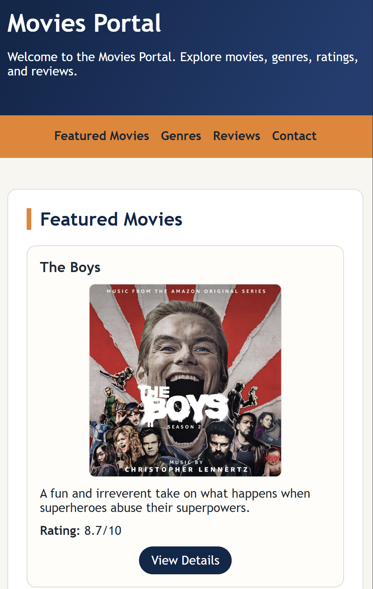
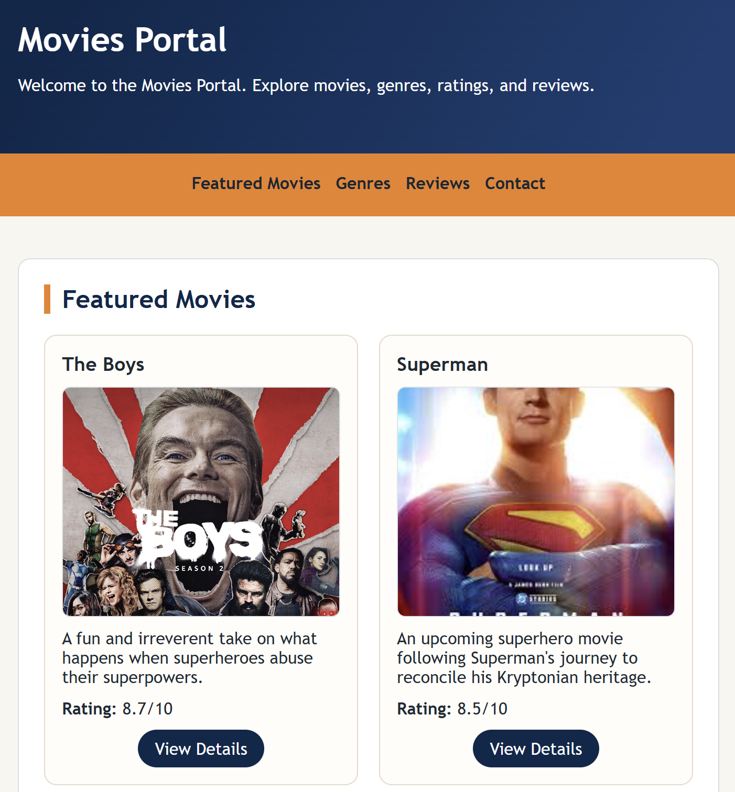

# CPSC-349 Lab 3: Responsive Movies Portal

## Overview

In Lab 3, the focus is responsive design. A responsive webpage changes its layout so it works well on different screen sizes, including desktop computers, tablets, and phones.

In this lab, students will inspect the existing Movies Portal, observe how the layout breaks on a phone-sized screen, uncomment a provided responsive design demo, and then complete a new responsive layout for iPad-sized screens.

This lab practices:

1. Browser DevTools device testing
2. CSS media queries
3. Responsive containers
4. Responsive navigation
5. Responsive movie card grids
6. Testing layouts across desktop, tablet, and phone sizes

---

## Getting Started

1. Open the lab repository on GitHub.
2. Click the **Fork** button to create a detached copy of this repository.


This repository is public by design, so there is no **Use this template** button like there was in the previous two labs. Forking the repository creates your own copy that you can edit and share as a GitHub URL.

3. Rename your forked repository to `firstname-lastname-lab-3`.
4. If possible, set the owner or organization to `csuf-cpsc349-summer2026`, as shown in the screenshot.


If you already forked this lab under your personal GitHub account, that is okay because this repository is public and I can still see your code. For other labs, make sure your work is published under the `csuf-cpsc349-summer2026` organization so I can access it.

5. Open the project in VS Code.
6. Open [index.html](index.html) in a browser by double-clicking the file or by using Live Server.
7. Confirm that the page loads.

Reference starting page:


---

## Inspect the Mobile Layout

1. Open the page in your browser.
2. Right-click the page and choose **Inspect**.


3. In DevTools, choose the responsive/device toolbar.


4. Switch to a phone-sized screen.
5. Notice that the page does not render properly on a phone screen. Text, images, the header, or the navigation may overflow because some layout widths are still designed for a large desktop screen.

---

## Demo: Add Phone Responsive Design

To implement the phone layout, open [styles.css](styles.css) and find the section labeled:

```css
/* DEMO: Uncomment to see effect */
```

Uncomment the phone media query below that section.

The main idea is this rule:

```css
@media (max-width: 640px) {
    /* phone styles go here */
}
```

This media query tells the browser:

> When the screen is 640px wide or smaller, use these CSS rules.

Inside that media query, the container, navbar, movie cards, and images are adjusted so they scale properly for a phone screen.

After uncommenting the demo section:

1. Save [styles.css](styles.css).
2. Refresh the page in the browser.
3. Test the page again in phone view.

The webpage should now load properly on a phone screen.


---

## Lab 3 Task: Add iPad Responsive Design

The main task for this lab is to optimize the Movies Portal for iPad and tablet screens.

In [styles.css](styles.css), find the empty section labeled:

```css
/* TODO: Add responsive design for iPads */
```

Use that empty code block to add a tablet media query. Your iPad layout should work for common iPad sizes, including iPad mini, iPad Air, and iPad Pro.

Your tablet layout should be between the desktop and phone layouts:

1. The page should not be cut off horizontally.
2. The header and navbar should fit neatly on the screen.
3. The movie cards should not appear as a single phone column.
4. The movie cards should not appear as one long desktop row.
5. The movie cards should display as a grid of 2 movies at a time.

You can reference this target iPad layout:


Hint: an iPad media query may use a larger max width than the phone media query:

```css
@media (max-width: 1024px) {
    /* tablet styles go here */
}
```
---

## Apply This to Your Own Movie Portal

After the provided Movies Portal works on phone and iPad screens, bring these responsive design changes into your own personalized movie portal.

Make sure all major components display properly in each device category:

1. Header
2. Navbar
3. Movie cards
4. Images
5. Genre list
6. Movie table
7. Review form
8. Footer

---

## Deploy with GitHub Pages

After your responsive layout is working, deploy your movie portal as a static site using GitHub Pages.

1. Publish your repository to GitHub.
2. Open your repository on GitHub and go to **Settings**.


3. Verify your repository name and remember it. You will need it for the final GitHub Pages URL.
4. Make sure the repository is public. If it is private, change the repository visibility to public.


5. In the repository settings, go to **Pages**.
6. Under **Build and deployment**, choose **Deploy from a branch**.
7. Choose the `main` branch if that is the branch you are currently working on.
8. Click **Save**.


After GitHub finishes deploying, your page should be available at:

```text
https://csuf-cpsc349-summer2026.github.io/<your repo name>/
```

If you deployed the repository under your personal GitHub account instead of the course organization, your URL may use your GitHub username instead:

```text
https://<your GitHub username>.github.io/<your repo name>/
```

For example, the reference link for this lab is:

[https://csuf-cpsc349-summer2026.github.io/cpsc-349-sm26-lab-3/](https://csuf-cpsc349-summer2026.github.io/cpsc-349-sm26-lab-3/)

Notice that the reference page should render properly on a computer, but it may not render properly on a phone yet. Your job is to fix the phone and iPad rendering, then deploy your own movie portal instead of only relying on the reference version.

You can check the deployment status in the GitHub Pages section after saving.


---

## Submission Requirements

Students must submit:

1. Updated Lab 3 repository with completed [index.html](index.html), [styles.css](styles.css), and [README.md](README.md)
2. A screenshot showing the phone layout working
3. A screenshot showing the iPad/tablet layout working
4. A working GitHub Pages link for the deployed movie portal
5. Evidence that the same responsive design approach was applied to the personalized movie portal
6. All screenshots must be decorated in the [README.md](README.md) file.

---

## My Responsive Layout

### Phone Layout



### iPad/Tablet Layout


